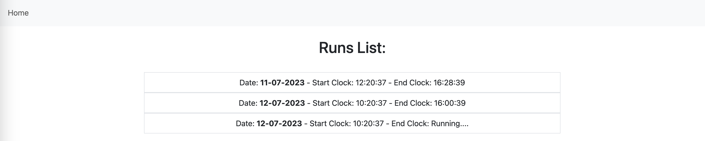

# Back-End Dashboard 

Il back-end della Web-Application ha il ruolo di esporre le dashboard che evidenziano le anomalie. Il codice è scritto in Java, utilizzando il framework Spring. Il lato server dell'applicazione ha la responsabilità di memorizzare i percorsi e salvare le anomalie in tempo reale dopo che vengono analizzate. Il back-end è affiancato dal database NoSQL MongoDB per memorizzare i dati.

Gli endpoint principali sono:

### /api/addRoute

Tramite una POST con un json come segue a questo endpoint si crea un nuovo percorso in cui si specifica quali sono i range che le Box dovrebbero rispettare.

```
{
    "description": "Trasporto di cibo pronto",
    "anomalies": [
        {
            "type": "temperature",
            "minValue": 25,
            "maxValue": 35
        },
        {
            "type": "humidity",
            "minValue": 20,
            "maxValue": 50
        },
        {
            "type": "pressure",
            "minValue": 900,
            "maxValue": 1100
        },
        {
            "type": "co2",
            "minValue": 300,
            "maxValue": 500
        },
        {
            "type": "light",
            "minValue": 0,
            "maxValue": 1
        },
        {
            "type": "horizontal",
            "minValue": 0,
            "maxValue": 1
        }
    ]
}
```

# Back-End Nordic Thingy:52 - Raspberry Pi

Il cuore del prototipo è composto dalle misurazioni dei valori ambientali tramite la board Thingy:52, e al loro trasferimento via bluetooth al Raspberry Pi, dove questi dati sono analizzati. Il Raspberry si interfaccia con il dispositivo Nordic Thingy:52 grazie alle sue bluetooth api, ed espone un server Node.js che permette la gestione delle operazioni fondamentali riguardanti l’analisi dell’ambiente. 
Questa applicazione Node.js utilizza il framework express, e presenta degli endpoint con lo scopo di selezionare i parametri ambientali che dovrebbero essere rispettati dalla Box, avviare l’analisi dell’ambiente, e terminarla.
Sul Raspberry gira anche il server WebSocket, che agisce come punto centrale nella comunicazione tra i client, in quanto ha il compito di ricevere i messaggi e inoltrarli ai vari utenti. Esso gestisce la connessione persistente, consentendo una comunicazione bidirezionale in tempo reale.
Il Raspberry permette prima di tutto di selezionare i range entro cui la Box contenenti i cibi pronti dovrebbe rimanere. Quando inizia la corsa, il Raspberry preleva le misure dell’ambiente effettuate dal Thingy:52 tramite BLE, e si occupa della loro analisi. Il thingy misura temperatura, pressione, umidità, co2, a cui si aggiunge la possibilità di controllare che la box rimanga orizzontale, o che abbia particolari condizioni di luce. Se il Raspberry nota dei valori anomali rispetto ai range prefissati, allora pubblica questa informazione via WebSocket sul topic corrispondente, dove l’applicazione mobile attende questi dati.
In questa repository sono presenti entrambi i codici per il server express (App.js) con il relativo script di analisi per l'ambiente (env_analysis.js), e il server WebSocket (ws_server.js) .
Per avviare il tutto, lanciare i comandi:
sudo node app.js
node ws_server.js

NOTA BENE: Il codice app.js richiede la versione di node 8.9.0, mentre ws_server.js richiede versione >= 10.2.0
Conviene quindi utilizzare un gestore di versioni come nvm. 

Gli endpoint principali sono i seguenti:

● POST a /set_params
Inviando una richiesta POST con un json come segue, è possibile selezionare i range che l’utente vorrebbe che la box rispettasse. Se verranno misurati valori al di fuori di questi intervalli, saranno considerati anomalie. Da notare che in caso non si specifichi un range, verranno utilizzati degli intervalli standard prestabiliti.
{ 
  "minCO2": 400, 
  "maxCO2": 1000, 
  "minTemp": 20, 
  "maxTemp": 30, 
  "minPress": 900, 
  "maxPress": 1100, 
  "minHum": 40, 
  "maxHum": 80, 
  "hasToBeDark": 0,   
  "hasToBeHorizontal": 0
}    


● GET a /start_analysis
Questo endpoint avvia un processo child che fa girare uno script Node.js che si occupa dell’analisi dell’ambiente prelevando i valori dal Thingy:52 tramite le sue bluetooth api. Il processo parent comunica al child le informazioni sui range che dovrebbero essere rispettati tramite argomento.
Lo script utilizza la libreria thingy analizzata precedentemente, e associa le funzioni di callback relative a ogni aggiornamento dei valori ambientali a cui si è interessati, così da poterli analizzare.
Quando questo script nota dei valori anomali, fuori dal range preimpostato, invia un messaggio via WebSocket sul topic relativo all’anomalia specifica (temperatura, umidità, ... ).  

● GET a /stop_analysis conclude l’analisi dell’ambiente, terminando il processo child.

# FrontEndIoT

## Applicazione mobile del conducente
Attraverso l’applicazione per smartphone il conducente è in grado di creare delle Box specifiche per il tipo di prodotto che deve trasportare. Egli può specificare dei range di valori all’interno del quale i valori ambientali dovrebbero rimanere.

<p align="center">
  
  
</p>


Nella schermata principale il conducente può selezionare una Box da monitorare, e far partire la corsa quando necessario. Una volta iniziata l’acquisizione, sarà visibile un timer che mostra da quanto è iniziata la nostra corsa. Quando i valori misurati saranno al di fuori dei range specificati nella Box, l’applicazione mostrerà in tempo reale questa informazione al conducente, specificando il tipo di anomalia, il valore della misura, e l’orario a cui si è presentata.

<p align="center">
  
</p>


Quando si è arrivati a destinazione è possibile premere il pulsante “Fine Corsa” in modo da terminare l’acquisizione delle informazioni. Una volta fatto questo comparirà un elemento a schermo che, una volta dopo averci cliccato sopra, renderà visibili tutte le anomalie rilevate durante quella corsa.

<p align="center">
  
  
  
</p>

## Dashboard Front End

Attraverso dei grafici presenti nell’applicazione web è possibile monitorare sia l’andamento degli “alert” che si sono presentati durante una corsa passata, o monitorare in diretta una corsa ancora attiva.



Attraverso la seguente pagina è possibile visualizzare lo storico delle corse ed i relativi dati. Nel caso di corse passate è possibile visualizzare il dato “End Clock” che indica l’orario di fine della corsa; invece, nel caso di corse ancora attive sarà presente la scritta “Running…”.
Una volta dopo aver cliccato sulla corsa da noi interessata, potremmo visualizzare i dati della corsa ed i relativi “Scatter Plot” che rappresentano le anomalie che si sono presentate. Le linee verdi presenti su ogni grafico indicano i valori soglia che si erano impostati all’attivazione della corsa dall’operatore.


## Architettura
L’architettura scelta è composta dalle seguenti componenti:

  ●	Nordic Thingy:52: questo è il dispositivo alla base del prototipo che si occupa delle misurazioni dei valori ambientali, e dell’invio di queste tramite BLE al Raspberry Pi. 
  
  ●	Raspberry Pi: Il Raspberry Pi riceve i dati misurati dal Thingy via BLE, e li analizza. Se questo trova delle anomalie dei valori rispetto ai range prestabiliti, invia questa informazione tramite WebSocket al gateway (ovvero lo smartphone del conducente).  
  
  ●	Smartphone del conducente: Il telefono del conducente ha il ruolo di gateway. Sullo smartphone gira un applicazione che permette di avviare una corsa, farla terminare, e ricevere tutte le anomalie riscontrate. Ogni volta che riceve l’informazione di un'anomalia via WebSocket da parte del Raspberry, la notifica al conducente, e la comunica alla dashboard in cloud.
  
  ●	Dashboard: La dashboard mette a disposizione un'interfaccia utente che consente di visualizzare i dati raccolti dal sistema IoT in modo chiaro e comprensibile. Attraverso la dashboard, gli utenti possono monitorare lo stato dei parametri rilevati per visualizzare eventuali anomalie. La dashboard offre funzionalità avanzate come grafici interattivi e filtri per migliorare la comprensione dei dati. 
  
  ●	Cloud: Il cloud rappresenta l'infrastruttura server remota che ospita i servizi di backend necessari per la web application con l’obiettivo di mostrare le dashboard dei percorsi. 

<p align="center">
  
</p>
  
Questa architettura permette una comunicazione efficiente tra i diversi componenti del sistema, consentendo una gestione tempestiva delle anomalie rilevate dai sensori. I dati vengono acquisiti, analizzati, inviati al telefono del conducente, e infine archiviati e visualizzati nel cloud attraverso una dashboard intuitiva.

## Collegamenti agli altri componenti
- [WOT - Ionic App](https://github.com/UniSalento-IDALab-IoTCourse-2022-2023/wot-project-2022-2023-ionicApp-Mele)
- [WOT - Front End Dashboard](https://github.com/UniSalento-IDALab-IoTCourse-2022-2023/wot-project-2022-2023-FrontEndAngular-Mele)
- [WOT - Back End Dashboard](https://github.com/UniSalento-IDALab-IoTCourse-2022-2023/wot-project-2022-2023-webapp-backend-DeNunzio)
- [WOT - Back End Raspberry (Nordic)](https://github.com/UniSalento-IDALab-IoTCourse-2022-2023/wot-project-backend-nordic-pi-DeNunzio)
  


Per avviare il progetto andare nella cartella di root e scrivere nel terminale: `ng serve`. Il server è visibile su `http://localhost:4200/`.
